# Email Application with Security Filtering

https://github.com/matanshaul7/EX1.git

## Overview

This project is a complete email application with an integrated security system. It consists of three main components:

1. **Frontend (React)** - User interface for email management
2. **Backend Server (Node.js)** - API handling user management, emails, and labels
3. **Bloom Filter Server (C++)** - Security service that filters malicious URLs

The system provides a Gmail-like interface where users can:
- Register and login
- Send and receive emails
- Organize emails with custom labels
- Search for emails
- Filter malicious content automatically before delivery

## Project Structure

```
EX1/
├── frontend/             # React user interface
├── backend/     		  # Node.js API server
├── Bloom_Filter_Server/  # C++ security filter
└── docker-compose.yml    # Container orchestration
```

## Running the Application

### Prerequisites
- Docker
- Docker Compose

### Start the System

```bash
# Start both servers
docker-compose up --build
```

This will:
- Build and start the Frontend, Backend, and Bloom Filter Server
- Make the frontend available at http://localhost:3000
- Make the backend API available at http://localhost:8080
- Make the security filter available on port 4000
To see the webpage itself, go to http://localhost:3000 in your web browser

### Stop the System

```bash
docker-compose down
```
or: `ctrl+c` at the same terminal

## Usage Examples

### User Registration & Login

1. Creating a New Account
- Navigate to http://localhost:3000/register
- Fill in your desired username
- Upload or link a profile picture (optional)
- Click "Sign up" to create your account

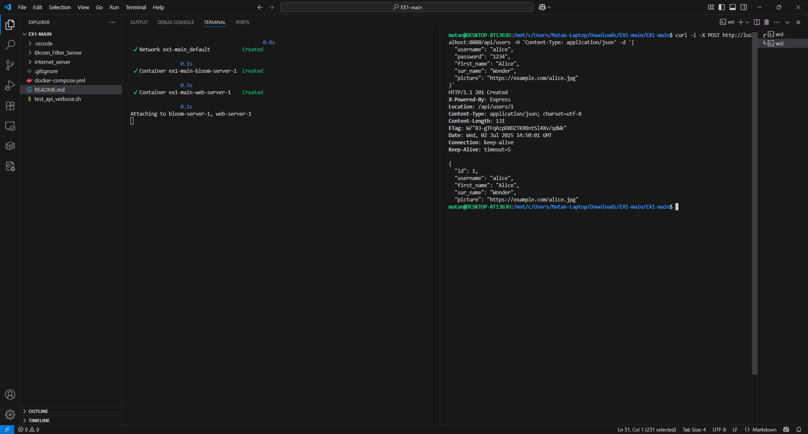

2. Logging In
- Navigate to http://localhost:3000/login
- Enter your username and password
- Click "Sign in" to access your account

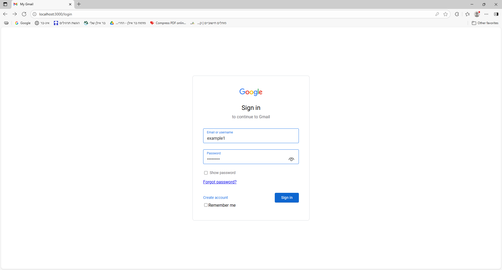 

### Email Management

3. Viewing Your Inbox
- After logging in, you'll see your inbox with all received emails
- Emails are sorted by date, with newest at the top
- Unread emails appear in bold

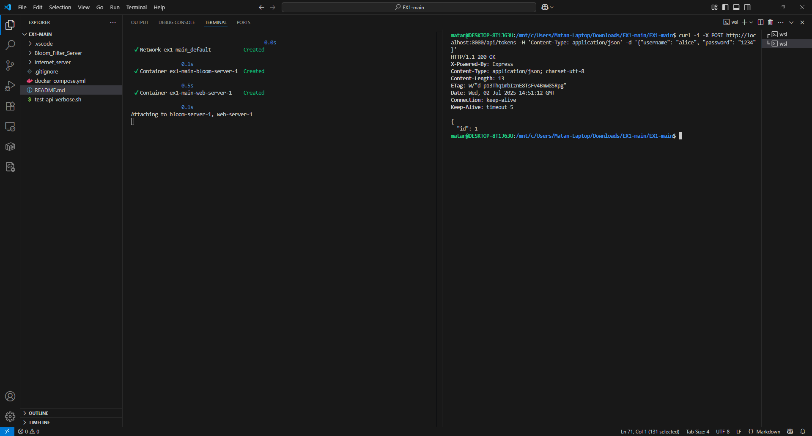

4. Composing a New Email
- Click the "Compose" button in the sidebar
- Enter recipient's username in the "To:" field
- Add a subject line
- Type your message in the body
- Click "Send" to deliver your email

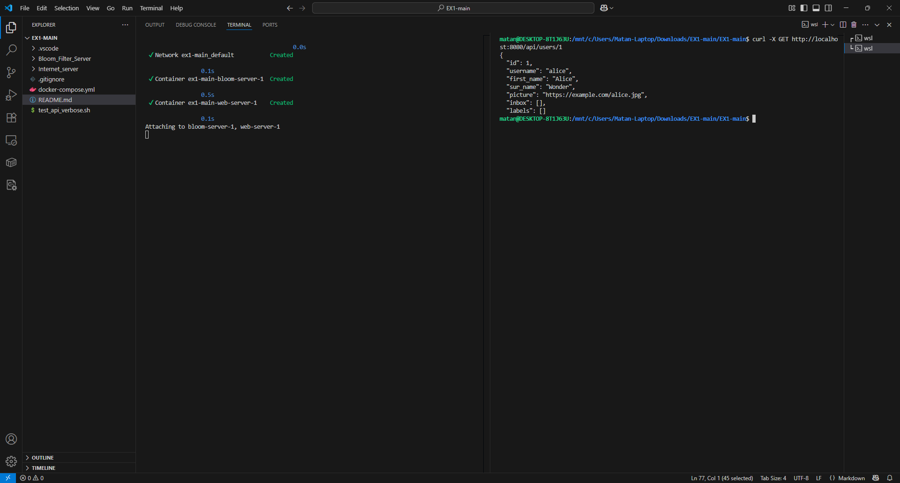

5. Reading an Email
- Click on any email in your inbox to open and read it
- The full email content appears in the right panel
- Sender information and timestamp are displayed at the top


### Organization Features

6. Creating a Custom Label
- Click the "+" icon next to "Labels" in the sidebar
- Enter a label name (e.g., "Work", "Personal")
- Click "Create" to add the new label

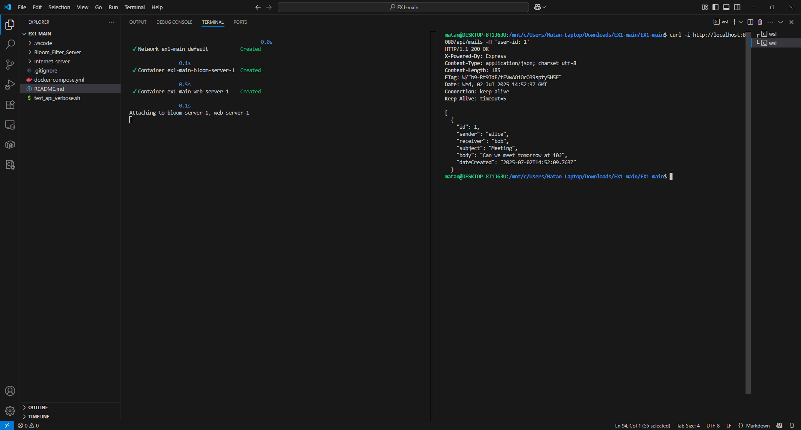

7. Applying Labels to Emails
- Open an email or select it from the list
- Click "Labels" dropdown
- Check the labels you want to apply

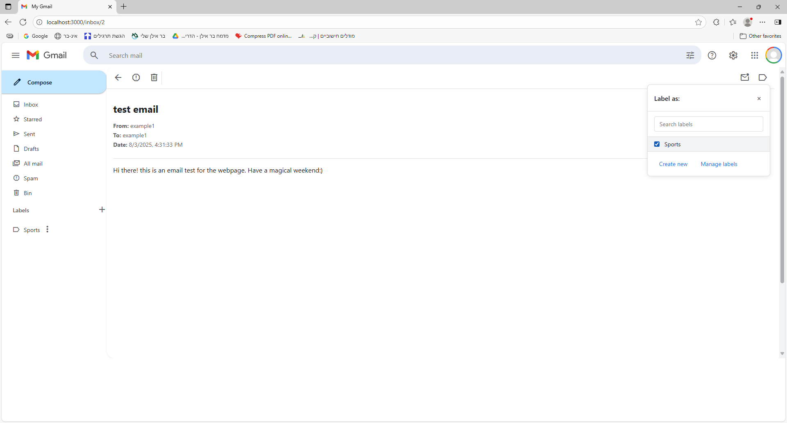

8. Filtering by Label
- Click on any label name in the sidebar
- The email list will show only emails with that label

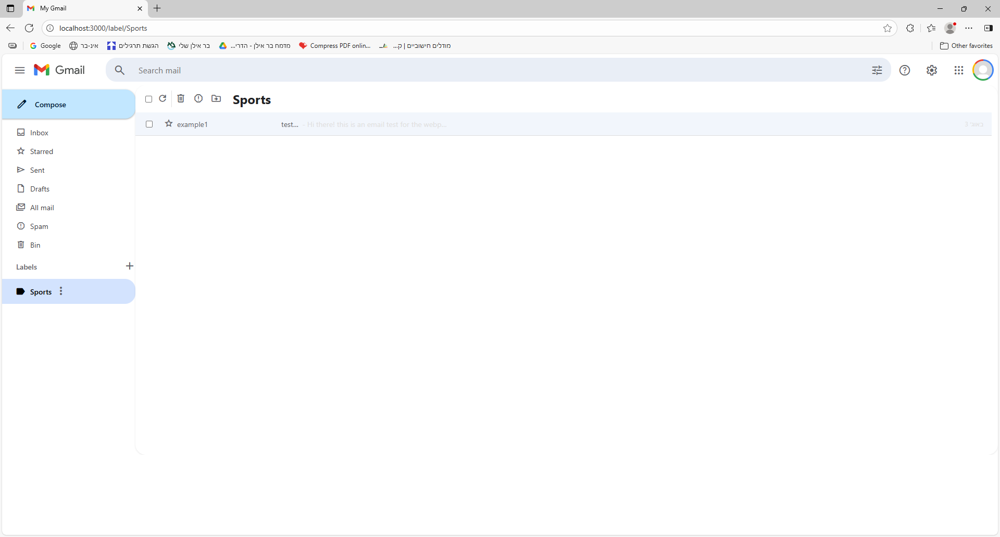

### Security Features

9. Reporting Spam
- Open an unwanted email
- Click "Report Spam" button
- The email is moved to spam folder and its sender patterns are recorded

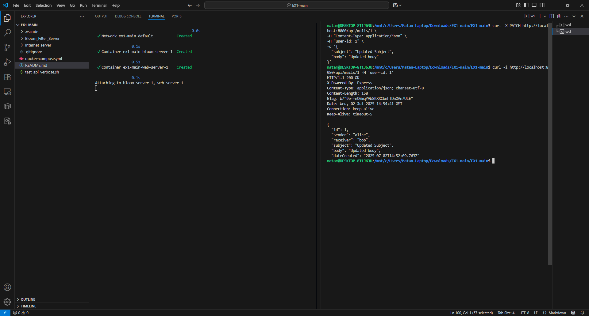

### Advanced Features

10. Searching Emails
- Type keywords in the search bar at the top
- Results update when you click the enter button, or the "search" icon
- Click on any result to open that email

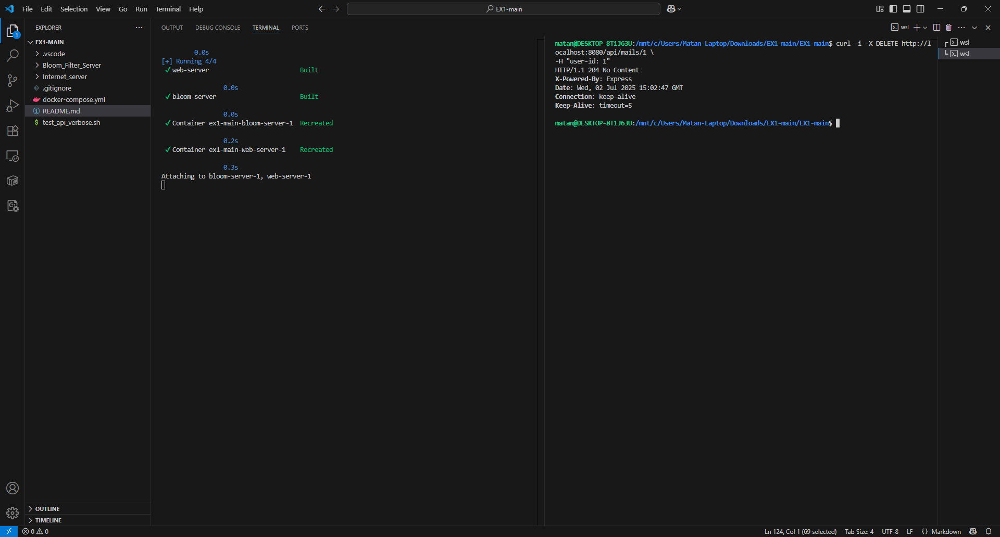

11. Email Actions
Each email has quick action buttons for:
- Back to the previous screen
- Report as Spam
- Delete
- Mark as unread
- Move to label

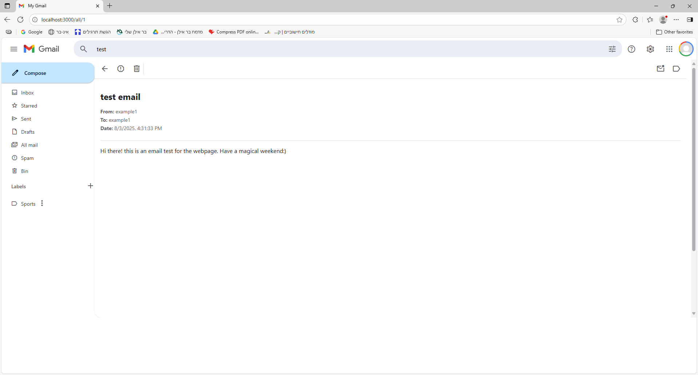

12. Mobile Responsive Design
- The application adapts to different screen sizes
- Sidebar collapses to icons on smaller screens

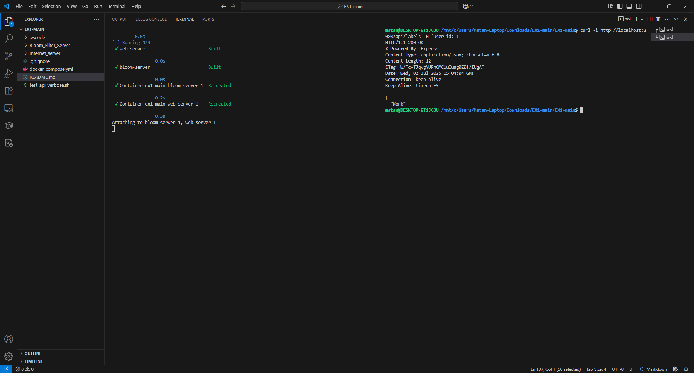

13. Theme Customization
- Click on the settings icon
- Choose between light and dark themes

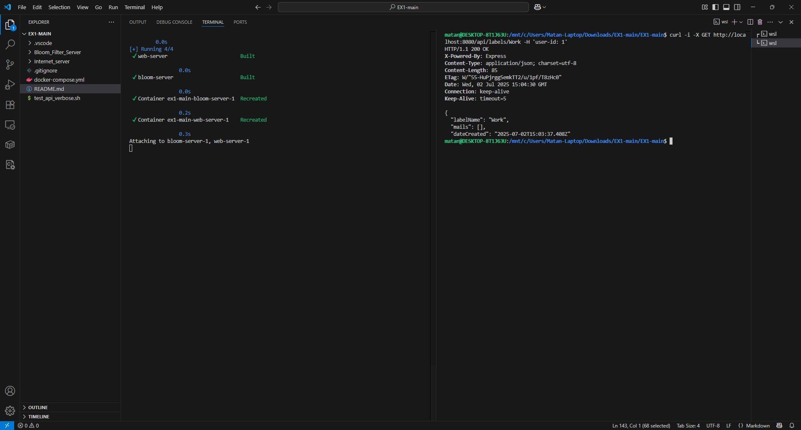