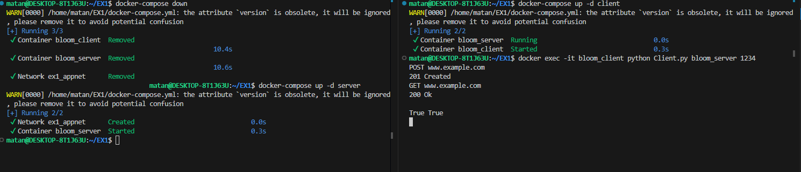
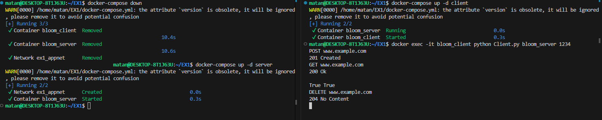
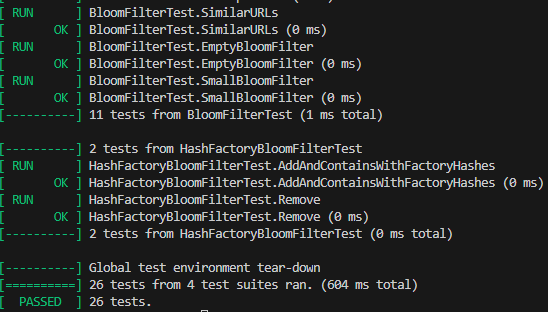

# Advanced Programming excesise 1
https://github.com/matanshaul7/EX1.git

## Extensibility & Open/Closed Principle

### Renaming Commands
In the previous implementation the **InputManager** parsed lines like POST X or GET Y and directly invoked the corresponding function. Renaming a command (for example, from `1` to `POST`) forced us to modify only the parsing logic inside `InputManager`, while the rest of the system remained untouched.

In our current design we’ve extracted command lookup into a dedicated **CommandFactory**. Now, InputManager simply splits each raw line into a verb and payload; the CommandFactory maps that verb to an ICommand implementation. Changing a command’s name today involves updating a single entry in the factory—no changes are needed in InputManager or any concrete command classes—keeping the dispatch logic closed to modification but open to extension.

### Adding New Commands
Previously, adding a new command (for example, DELETE) meant updating InputManager’s parsing logic so it could recognize and dispatch that verb.  

Now, the **CommandFactory** centralizes all command-name → class mappings. To introduce a brand-new command you simply:
1. Create a new **ICommand** subclass (e.g. DeleteCommand).  
2. Register its keyword in the factory’s map.  

No existing parsing or dispatch code needs to change—only the new class and its factory registration are added, keeping the system closed for modification but open for extension.

### Changing Command Output Format
In the previous implementation **InputManager** both dispatched commands and formatted their responses, so any tweak to a command’s output required editing its logic there.  

In our current design each **ICommand** implementation is responsible for its own output: when executed it returns the exact response string it requires. Changing the output of a single command now only requires modifying that one command class—no central dispatcher or input logic must be touched—keeping the system closed to modification but open for command-specific extensions.

### Switching Input Source
Previously, **InputManager** treated every incoming line—whether from the console or a socket—as a raw string to parse and dispatch. Swapping the input transport (console <-> socket) never required touching command-dispatch or business logic.

In our current design we’ve maintained that abstraction and simplified it further: every raw string still goes through the same parsing pipeline and is handed off to a command, regardless of origin (STDIN, TCP socket, etc.). Changing the I/O layer now involves swapping or extending only **Server** (or the main function). All downstream code—**CommandProcessor** and individual commands—remains closed to modification but open to new input sources.  
  
## URL Server project-Explanation  
### About the project:  
This project is a simple URL filtering system using a Bloom filter. In addition, there is a server that responds to a client that sends requests to the blacklist of the server. We built it using Test Driven Development (TDD) and clean SOLID-based 
C++ design. The link to our Jira project: https://ilaip100.atlassian.net/jira/software/projects/AE/summary

### How it works:  
The program reads an initial config line: [command] [url]. Then:  
If the command is `POST`, add the url to the blacklist. If succeeded, prints `201 Created`.   
If the command is `GET`, check if the url is blacklisted. Before returning the answer, prints `200 Ok`.  
If the Command is `DELETE`, remove the url from the blacklist. If succeeded, prints `204 No Content`.  
The Bloom filter is saved automatically to a file and reloaded on program restart.

### How to run:  
Make sure you have Docker and Docker Compose installed. To build the server, write this command line:  
"docker-compose up -d server". To build the client, write this command line: "docker-compose up -d client". To run the client, writ this command line:  
"docker exec -it bloom_client python Client.py bloom_server 1234". To build the unit tests, write this command line: "docker-compose build tests".  
To run the tests, write this command line: "docker-compose run --rm tests".

**NOTE:** When you are done using the server and the client, you must write the command line: "docker-compose down" to shut down the server and the client. If you don't, the program will not work!!
Screenshots:

Adding a URL: 
  

Checking for URL:  
  

Deleting a URL:  
  

Running tests on docker-compose:  

## UML diagram for illustration:

