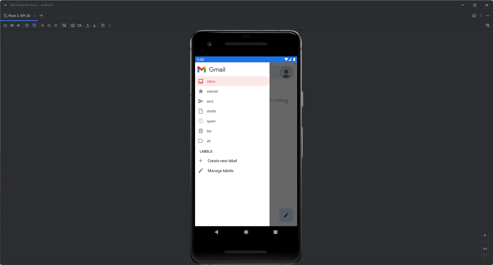
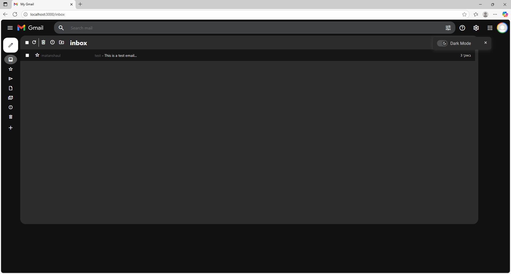

# 📬 Gmail - Home & Mails

This guide explains the **Home/Inbox screen**, searching, reading messages, composing mail, labels, and common actions for both **Web** and **Android**.

---

## 📑 Table of Contents
1. [Home / Inbox Overview](#-home--inbox-overview)
2. [Searching for Emails](#-searching-for-emails)
3. [Reading a Message](#-reading-a-message)
4. [Composing & Sending](#-composing--sending)
5. [Labels, Filters & Folders](#-labels-filters--folders)
6. [Bulk Actions & Swipe (Android)](#-bulk-actions--swipe-android)
7. [Refresh & Sync](#-refresh--sync)
8. [Theme (Light/Dark)](#-theme-lightdark)
9. [Notifications (Android)](#-notifications-android)

---

## 🏠 Home / Inbox Overview
After logging in, users land on the **Inbox**. It includes:
- ✉️ **Message List** grouped by **label/category** (*All / Inbox / Starred / Sent / Drafts / Bin / Custom Labels*).
- 🔍 **Search Bar** at the top to find emails by fields like **subject**, **sender**, **content**, and **labels**.
- 🧭 **Side Drawer** (Web: left sidebar, Android: navigation drawer) containing labels and quick navigation.
- 👤 **User Profile & Logout** (Web: top-right avatar menu; Android: in the drawer header).
- ➕ **Compose** button to create a new email (Web: top-left; Android: FAB in the bottom-right).

**Web - Inbox example**

**Android - Inbox example**

---

## 🔍 Searching for Emails
- **Web:** Use the **top search bar**. Type part of the subject, sender, or any keyword. Hit **Enter** to search.
- **Android:** Tap the **search icon**, type your query, then **Enter**. Tap the icon again to close the bar.

Results appear in a **Search Results** screen where you can refine the query or open any mail.

**Search - Web**

**Search - Android**

---

## 📖 Reading a Message
Open any mail from Inbox, Sent, or Search to view its details:
- 🧾 **Subject**, **Sender/Recipients**, **Date & Time**
- 📝 **Body** (rich text, links, inline images)
- 📎 **Attachments** (download / open)
- 🏷️ **Labels** applied to the message
- 🔁 **Reply**, **Reply All**, **Forward**
- 🗑️ **Move to Bin**, **Archive**, **Mark as Read/Unread**

**Web:** The message opens in a dedicated view or a centered panel.  
**Android:** Opens as a full screen; use the **Back** button to return to the list.

**Message - Web**

**Message - Android**

---

## 📨 Composing & Sending
Tap **Compose** to open the editor.

**Required fields**
- **To** (one or more recipients, comma-separated)
- **Subject**
- **Body** (supports basic formatting)

**Drafts flow**
- A draft is created immediately when you start composing.
- Closing the editor saves the **Draft** automatically.
- Sending removes the draft and creates a **Sent** message.

**Web - Compose**

**Android - Compose**

---

## 🏷️ Labels, Filters & Folders
- **System labels**: *All / Inbox / Starred / Sent / Drafts / Bin / Unread*.
- **Custom labels**: You can create and assign your own labels.
- **Applying labels**: From the message view or long-press/checkbox selection in the list.
- **Filters**: Search by label (e.g., `label:work`), or combine queries (e.g., `from:alice subject:report has:attachment`).

**Sidebar / Drawer**
  

---

## 🧹 Bulk Actions
- **Web (bulk)**: Use **checkboxes** to select multiple mails → **Delete**, **Archive**, **Mark as read/unread**, **Apply labels**.

---

## 🔄 Refresh & Sync
- **Web:** The list updates automatically; you can also refresh the page.
- **Android:** Pull **down** on the list to **refresh** Inbox, Search results, or label views.

**Pull to Refresh - Android**

---

## 🌗 Theme (Light/Dark)
Switch between **Light** and **Dark** themes:
- **Web:** Toggle in the header (moon/sun icon).
- **Android:** Toggle in the **Options** panel or device theme sync (if enabled).

> The chosen theme is **persisted** and applied across all app screens.

**Theme Toggle - Web/Android**
  

---

✅ With these screens and flows, email management is **consistent**, **fast**, and **intuitive** across **Web** and **Android**.
